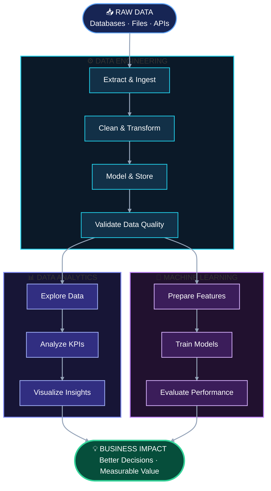

# 🔄 The Journey from Raw Data to Intelligent Decisions

```mermaid
flowchart TB
    A(["📥 RAW DATA<br/>Databases · Files · APIs"])

    A --> B

    subgraph DE["⚙️ DATA ENGINEERING"]
        direction LR
        B["Extract & Ingest"] --> C["Clean & Transform"]
        C --> D["Model & Store"]
        D --> E["Validate Data Quality"]
    end

    E --> F

    subgraph DA["📊 DATA ANALYTICS"]
        direction LR
        F["Explore Data"] --> G["Analyze KPIs"]
        G --> H["Visualize Insights"]
    end

    E --> I

    subgraph ML["🤖 MACHINE LEARNING"]
        direction LR
        I["Prepare Features"] --> J["Train Models"]
        J --> K["Evaluate Performance"]
    end

    H --> L
    K --> L

    L(["💡 BUSINESS IMPACT<br/>Better Decisions · Measurable Value"])

    classDef source fill:#172554,stroke:#60A5FA,color:#FFFFFF,stroke-width:2px
    classDef engineering fill:#123047,stroke:#22D3EE,color:#FFFFFF,stroke-width:1.5px
    classDef analytics fill:#312E81,stroke:#A5B4FC,color:#FFFFFF,stroke-width:1.5px
    classDef machine fill:#3B1D5A,stroke:#D8B4FE,color:#FFFFFF,stroke-width:1.5px
    classDef outcome fill:#064E3B,stroke:#34D399,color:#FFFFFF,stroke-width:3px

    class A source
    class B,C,D,E engineering
    class F,G,H analytics
    class I,J,K machine
    class L outcome

    style DE fill:#0B1928,stroke:#22D3EE,stroke-width:2px
    style DA fill:#171536,stroke:#818CF8,stroke-width:2px
    style ML fill:#21112F,stroke:#C084FC,stroke-width:2px

    linkStyle default stroke:#94A3B8,stroke-width:2px
```

 

**ENGINEER THE DATA → ANALYZE THE STORY → TRAIN THE MODEL → CREATE VALUE**

